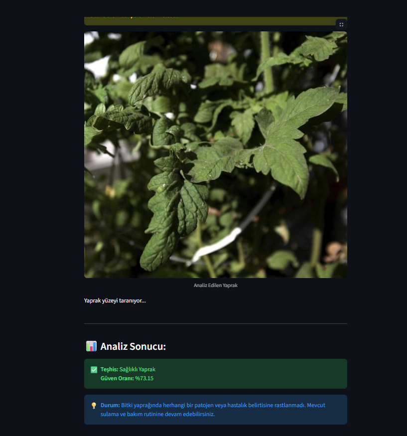
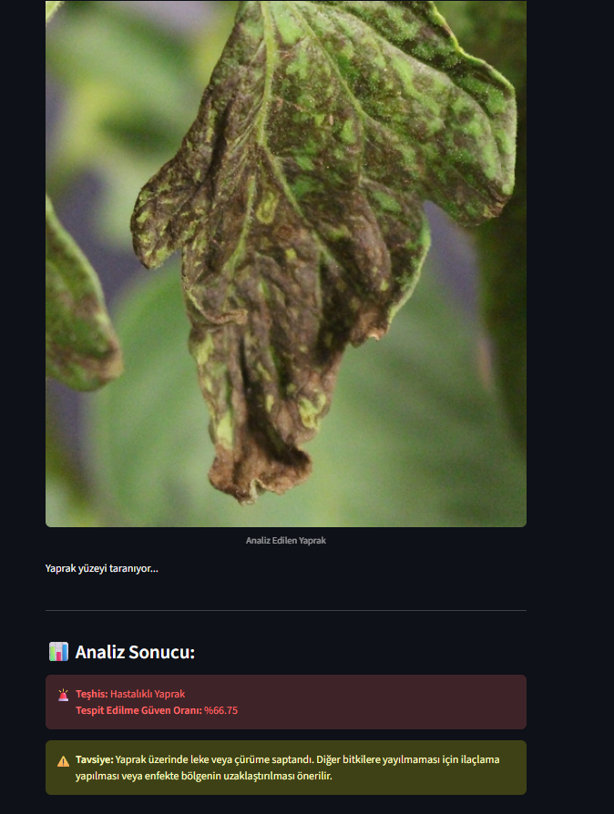

# 🌱 Derin Öğrenme ile Yaprak Sağlık Durumu Kontrol Sistemi

Bu proje, tarımsal verimliliği artırmak amacıyla yaprak fotoğrafları üzerinden bitkilerin sağlık durumunu analiz eden bir derin öğrenme sistemidir. **MobileNetV3 Large** mimarisi kullanılarak Transfer Learning yöntemiyle eğitilmiş ve **Streamlit** kütüphanesi ile kullanıcı dostu bir web arayüzüne dönüştürülmüştür.

## 📊 Proje Özellikleri ve Veri Dengeleme
* **Hedef Bitkiler:** Domates, Patates ve Biber yaprakları.
* **Teşhis Sınıfları:** Sağlıklı Yaprak / Hastalıklı Yaprak (Binary Classification).
* **Veri Seti Optimizasyonu:** Orijinal veri setindeki 17.000 Hastalıklı / 3.200 Sağlıklı görsel arasındaki büyük dengesizlik, eğitim öncesinde **Undersampling (Rastgele Silme Scripti)** yöntemiyle çözülmüş ve dengeli bir eğitim (3.200 - 3.200) sağlanmıştır.
* **Model Başarımı (Validation Accuracy):** %70.50

---

## 📸 Uygulama Ekran Görüntüleri ve Analizler

### 1. Sağlıklı Yaprak Teşhis Örneği


### 2. Hastalıklı Yaprak Teşhis ve Tavsiye Örneği


---

## 🚀 Projeyi Yerelde Çalıştırma

Projenin bilgisayarınızda test edilmesi için aşağıdaki adımları takip edebilirsiniz.

### 1. Gerekli Kütüphanelerin Kurulması
```bash
pip install tensorflow streamlit pillow numpy scikit-learn